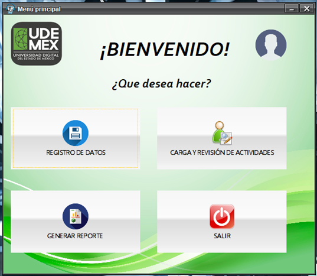
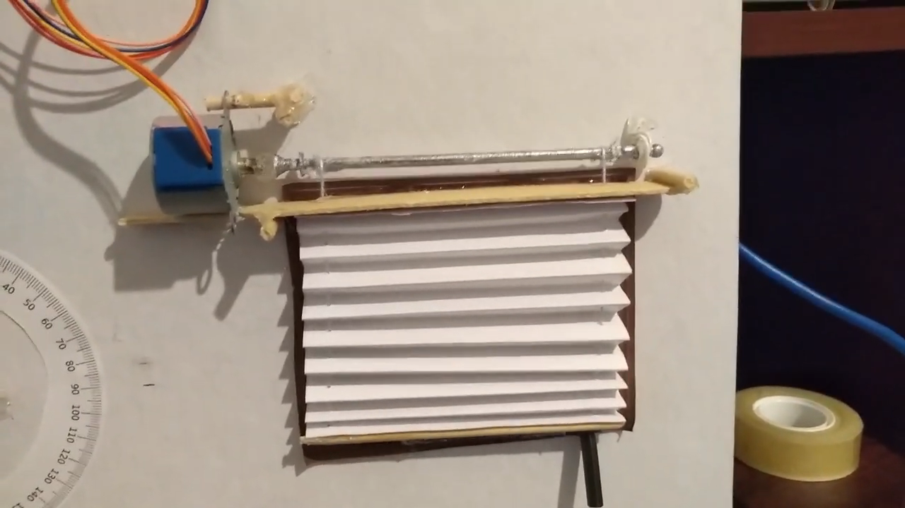

<h1>&#128512 Hi, welcome to my GitHub profile! 
I'm Sebastián
</h1>
 

Here you will find examples of projects I have worked on, as well as information about my skills and experience. If you are looking for a backend trainee developer with the right attitude, talent and willingness, don't hesitate to contact me. I would love the opportunity to talk to you about how we can work together! &#128188

## About me

I am a recent graduate of the Universidad Mexiquense del Bicentenario with a degree in computer science, I am passionate about technology since I was 9 years old and I have been interested in the IT area since I was 15. I have taken some courses during my journey as a technical professional and university studies, during my experience in this area I have acquired a particular interest in backend development and I would love to focus my professional progress in it.

## My skills

- POO
- Java with NetBeans and IntelliJ IDEA
- SQL with MySQL and Microsoft SQL Server
- GIT basic usage
- Spring basic usage

<table border="0">
    <tr>
        <td></td>
        <td></td>
        <td></td>
    </tr>
    <tr>
        <td></td>
        <td></td>
        <td></td>
    </tr>
</table>

You can click <a href="https://mega.nz/folder/cz5HnLYQ#oWe8Qg9C9G-ieaY5RMzBlw">HERE</a> to see my certificates

 

## My best projects
<table>
<tr>
<td width="50%">
<h3 align="center">Aplicación para simplificar la revisión de actividades en UA Ixtapaluca</h3>

Application developed with Java, Mysql and the LenguajeTool and JavaFX libraries.

                                                                                      
</td>

<td width="50%">
                
<h3 align="center">Aplicación para el cierre automático de persianas</h3>

                                       

 

Application developed with Java and C connected with Arduino and a stepper motor to open and close a miniature blind.

                                                             
</table>                                                                                 

 

### ⚙️ &nbsp;GitHub Analytics

